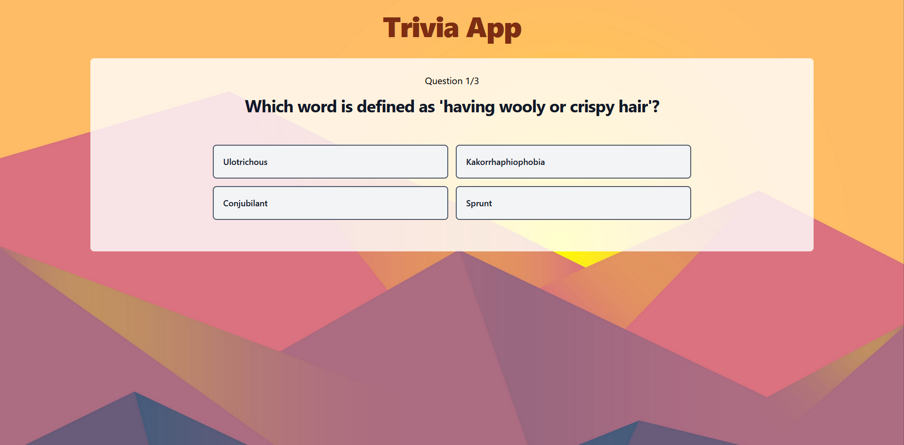

# Trivia App


## How to access
This website is hosted on Github Pages at https://jarodc37.github.io/trivia-app/
Select your desired category and number of questions to begin!


## Set up
All questions and answers in this application are generated by https://the-trivia-api.com/

To start, clone the project and run the following commands
``` bash
npm install
npm run dev
```

## Best Practices
1. Using useContext and useReducer to manage state
2. Splitting into different components and using folder structure
3. Using tailwindcss
4. Tried to use good code practices e.g. conditional renders